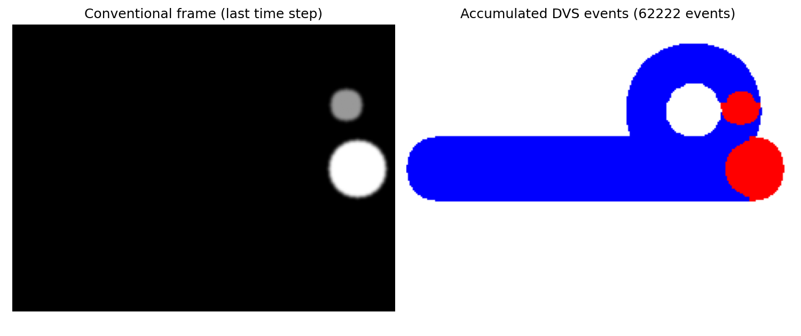
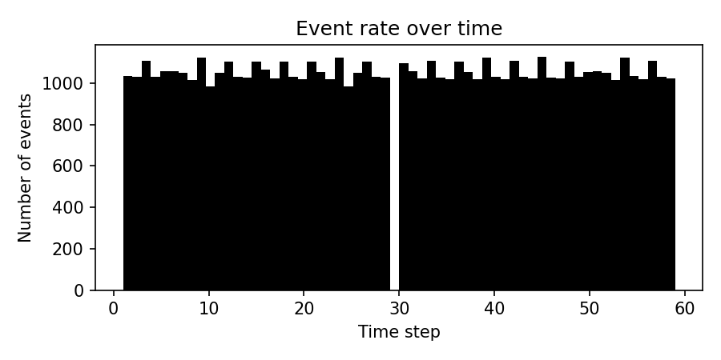

# Event Camera (DVS) Simulation — First Hands-On Exploration

A small, from-scratch implementation of the standard event-camera generative
model, combined with a real-video experiment using the open-source simulator
`v2e`. Built as a first practical step into event-based vision and robot
perception with event cameras, ahead of a PhD application in this area.

## Background

Event cameras (Dynamic Vision Sensors, DVS) don't output frames like
conventional cameras. Each pixel independently reports an event
`(x, y, t, polarity)` whenever the log intensity at that pixel changes by
more than a contrast threshold `C`:

```
event fires when |log(I(x, y, t)) - log(I(x, y, t_last))| > C
```

This repository contains two complementary approaches:

1. **Custom Python implementation**
   - Synthetic scene generation using OpenCV.
   - Event generation using the standard log-intensity model above.
   - Visualization of accumulated events and event rates.

2. **Real video-to-event conversion using `v2e`**
   - Recorded a short smartphone video.
   - Converted the conventional video into simulated DVS events using the
     open-source simulator `v2e`.
   - Generated approximately 9.98 million events from a 4.2-second video
     sequence.
   - Produced a DVS-style video (`dvs_video.avi`) showing how an event
     camera would perceive the scene.

## Motivation

I wanted a genuine, hands-on introduction to event-based vision by:

- understanding the mathematical event-generation model,
- implementing a simple simulator from scratch,
- and applying a state-of-the-art community tool (`v2e`) to real video data.

This work is inspired by:

> Gallego, G., Delbrück, T., Orchard, G., et al. "Event-based Vision: A
> Survey." *IEEE TPAMI*, 2020.

## Results

### Custom Simulation

| Original synthetic frame | Simulated event output |
|:---:|:---:|
|  |  |

### v2e Simulation on Real Video

| Original smartphone frame | Simulated DVS output |
|:---:|:---:|
|  |  |

Full video output: [`media/dvs_video.avi`](media/dvs_video.avi)

| Metric | Value |
|---|---|
| Input | Smartphone video, 4.2 s, 127 frames |
| Input resolution | 1080 × 1192 px |
| Output resolution (DAVIS346 model) | 346 × 260 px |
| Generated events | ~9.98 million |
| ON events | ~5.14 million |
| OFF events | ~4.84 million |
| Average event rate | 2.38 MHz |

## Analysis

The event camera responds only to changes in brightness. Static regions
generate almost no events, while moving object boundaries produce dense
streams of ON and OFF events.

Observations from this experiment:

1. Event activity is concentrated on moving edges.
2. Background regions are nearly event-free.
3. Positive and negative events appear in pairs during motion.
4. The event representation is significantly more sparse than conventional
   video.
5. Event cameras provide very high temporal resolution and low latency,
   making them attractive for robotics and autonomous systems.

## Repository Structure

```
.
├── event_camera_simulation.py      # custom DVS simulator (from scratch)
├── event_simulation_result.png     # output of the custom simulator
├── event_rate_over_time.png        # event-rate plot from the custom simulator
├── README.md
├── requirements.txt
└── media/
    ├── mein_video.mp4              # smartphone input video
    ├── ferrari.jpg                 # example input frame
    ├── ferrari_out.jpg             # example simulated DVS frame
    ├── dvs_video.avi               # full v2e output video
    └── dvs_video-frame_times.txt   # per-frame timestamps from v2e
```

## Run the Custom Simulation

```bash
pip install numpy opencv-python matplotlib
python event_camera_simulation.py
```

## Run v2e

```bash
pip install v2e

python -m v2e \
    -i media/mein_video.mp4 \
    --dvs346 \
    --disable_slomo \
    -o output_folder \
    --dvs_vid dvs_video.avi
```

## Future Work

- Experiment with public event datasets (DSEC, MVSEC).
- Investigate event-based optical flow and feature tracking.
- Apply event cameras to robotics and autonomous systems.
- Integrate event-based perception into ROS2 applications.

## Acknowledgements

This project uses the excellent open-source simulator:

- v2e: https://github.com/SensorsINI/v2e
- ESIM: https://github.com/uzh-rpg/rpg_esim
